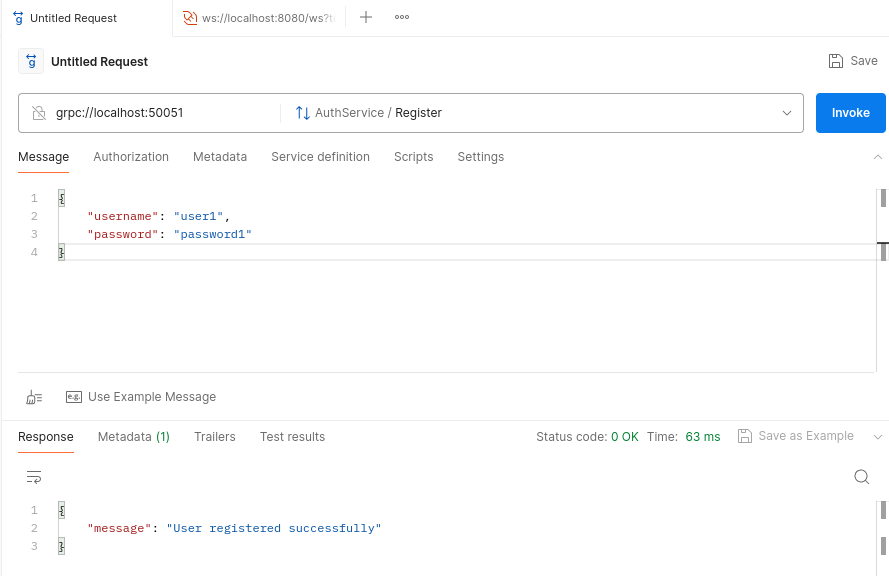
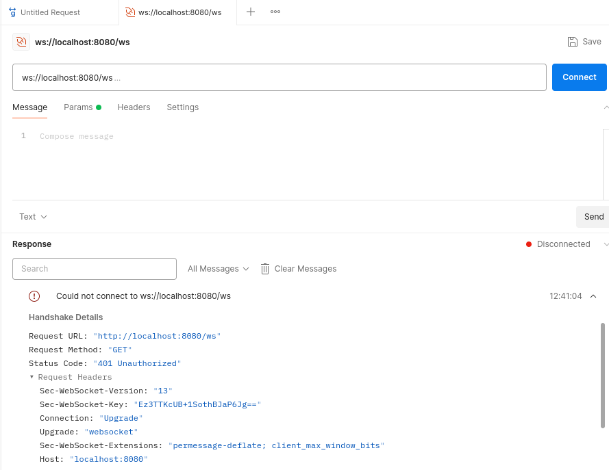
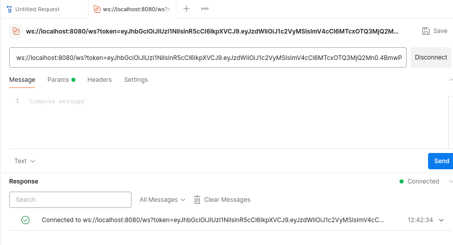
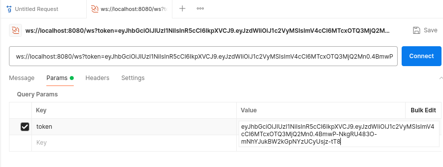
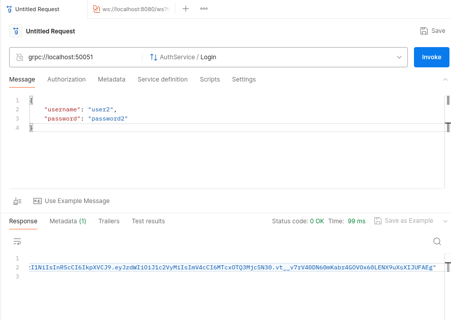
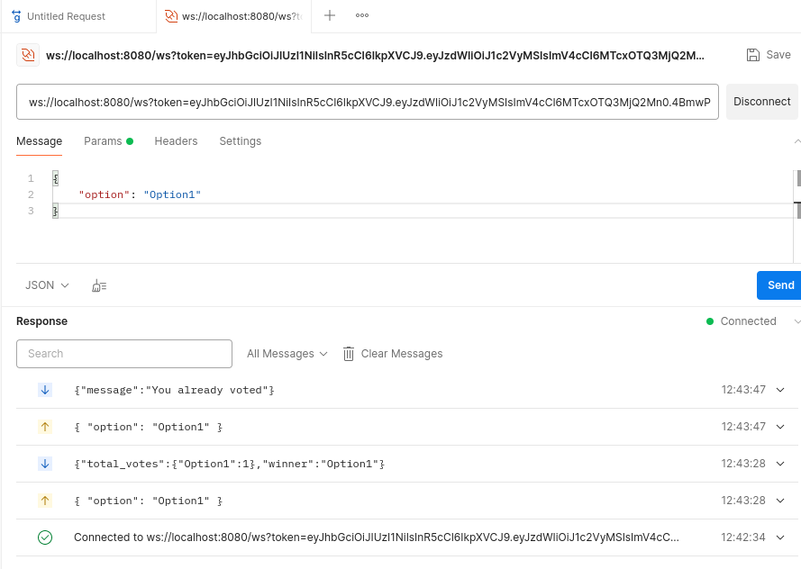
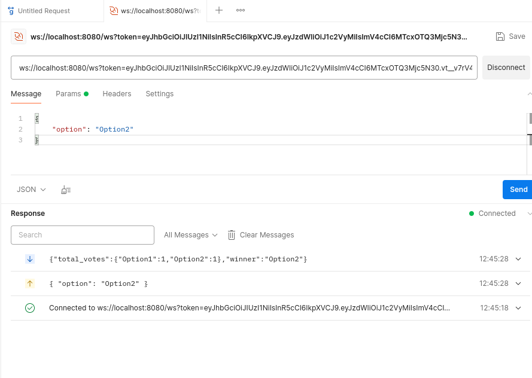
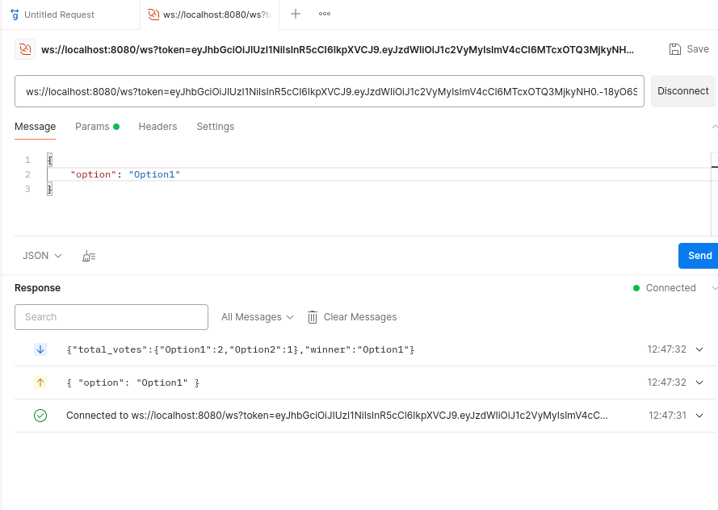

## Real-Time-Voting-System

To build a real-time collaborative voting system backend that allows multiple users to create, join, and participate in voting sessions. The application should   demonstrate the use of WebSockets for real-time updates, Go-routines for handling concurrent connections, and gRPC for managing voting operations and user authentication.

#### To proceed for this project first understand what are requirements
## Requirements

- Go 1.19 or later
- Docker
- Redis

- go install google.golang.org/protobuf/cmd/protoc-gen-go@latest
- go install google.golang.org/grpc/cmd/protoc-gen-go-grpc@latest
- export PATH=$PATH:$(go env GOPATH)/bin

### Feature
- User registration and authentication using gRPC and JWT.
- Real-time voting updates using WebSockets.
- Redis for storing user sessions and vote counts.
- Dockerized for easy deployment.

### Endpoints
gRPC Enpoints 
- grpc://localhost:50051/AuthService/Register
-- grpcurl -plaintext -d '{"username": "user1", "password": "password1"}' localhost:50051 auth.AuthService/Register

- grpc://localhost:50051/AuthService/Login
-- grpcurl -plaintext -d '{"username": "user1", "password": "password1"}' localhost:50051 auth.AuthService/Login

- grpc://localhost:50051/AuthService/Logout
-- grpccurl -plaintext -d '{"username": "user1", "password": "password1"}' localhost:50051 auth.AuthService/Logout

WebSockets Endpoints
-- ws://localhost:8080/ws?token=<JWTTOKEN>

### Inputs and Outputs are stored in image format
testing_outputs           